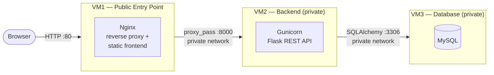

# Architecture

Three-tier deployment across three EC2 instances on a shared VPC, each in its
own security group.

## Request flow

1. **Static assets and page loads** (`/`, `/css/*`, `/js/*`) are served
   directly by Nginx on VM1 from `/var/www/urlshortener`.
2. **API calls** (`/api/shorten`, `/api/stats/<code>`) are proxied by Nginx to
   the Flask app on VM2 (Gunicorn, port 8000).
3. **Short-link visits** (`/<code>`) don't match a static file, so Nginx's
   `try_files ... @backend` fallback proxies them to VM2, which looks up the
   code, records a click, and issues an HTTP 302 redirect to the original URL.
4. **VM2** talks to MySQL on VM3 via SQLAlchemy over the private network.

## Security boundaries

- Only VM1 has a public IP / is reachable from the internet (inbound 80/tcp,
  and 22/tcp for admin access, from your IP only).
- VM2's security group allows inbound 8000/tcp **only from VM1's security
  group or private IP**, plus 22/tcp for admin access.
- VM3's security group allows inbound 3306/tcp **only from VM2's security
  group or private IP**, plus 22/tcp for admin access.
- Neither VM2 nor VM3 should have a public IP in production.

## Why this shape

- Nginx as the only public-facing service keeps the attack surface small and
  gives a natural place for rate limiting, gzip, and (later) TLS termination.
- Flask/Gunicorn is stateless — the `urls`/`clicks` tables in MySQL are the
  only shared state, so VM2 can be scaled horizontally behind VM1 if needed
  without code changes.
- MySQL is isolated on its own VM so its resource usage (and blast radius, if
  compromised) is separate from the app tier.
